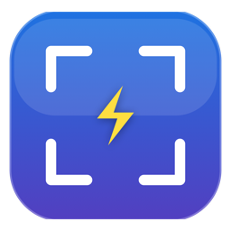
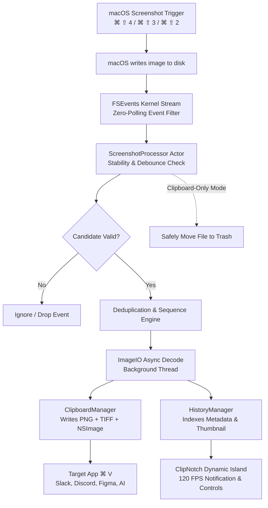

<p align="center">
  
</p>

<h1 align="center">ClipShot</h1>

<p align="center">
  <strong>The ultra-responsive, intelligent macOS screenshot-to-clipboard engine & Dynamic Notch companion.</strong><br>
  <em>Take a screenshot. Paste it anywhere in milliseconds. Zero clutter. Zero polling. Pure flow.</em>
</p>

<p align="center">
  <a href="#system-requirements"></a>
  <a href="#building-and-running"></a>
  <a href="#how-it-works-under-the-hood"></a>
  <a href="#clipnotch--the-dynamic-island-for-mac"></a>
  <a href="#privacy--offline-architecture"></a>
  <a href="LICENSE"></a>
</p>

---

## 📚 Documentation Hub

Explore in-depth documentation guides for ClipShot:

| Guide | Description |
| :--- | :--- |
| **[ClipNotch Guide](docs/CLIPNOTCH.md)** | Dynamic Notch companion, 14 colorways, 6 finishes, motion physics. |
| **[Architecture Deep-Dive](docs/ARCHITECTURE.md)** | Kernel `FSEvents`, actor isolation, atomic multi-type pasteboard writes. |
| **[Permissions Setup](docs/PERMISSIONS.md)** | macOS Screen Recording and file permission setup and troubleshooting. |
| **[Keyboard Shortcuts](docs/KEYBOARD_SHORTCUTS.md)** | Global hotkeys, crosshairs navigation, and pixel nudge controls. |
| **[CLI & Testing](docs/CLI_AND_TESTING.md)** | Terminal debugging, SPM test filters, and diagnostic scripts. |
| **[Apple Vision OCR](docs/OCR_GUIDE.md)** | On-device neural OCR, code snippet preservation, and languages. |
| **[Color Picker Guide](docs/COLOR_PICKER.md)** | Precision pixel magnifier, HEX / RGB / HSL / Display P3 formats. |
| **[Measurement & Ruler](docs/MEASUREMENT_TOOL.md)** | On-screen Euclidean distance calculation and bounding margins. |
| **[Annotation Studio](docs/ANNOTATION_STUDIO.md)** | Vector arrows, blur & pixelate redactions, step badges, typography. |
| **[Floating Pin](docs/FLOATING_PIN.md)** | Stay-on-top reference windows with variable transparency. |
| **[History & Cache](docs/HISTORY_ARCHIVE.md)** | Searchable capture archive, thumbnail caching, and pruning rules. |
| **[Command Palette](docs/COMMAND_PALETTE.md)** | Spotlight-style launcher (`⌥ Space`) and fuzzy search. |
| **[Screen Recording](docs/RECORDING_GUIDE.md)** | Hardware-accelerated MP4 video and animated GIF capture. |
| **[Scrolling Capture](docs/SCROLLING_CAPTURE.md)** | Vertical frame stitching for long documents and code files. |
| **[Troubleshooting](docs/TROUBLESHOOTING.md)** | Diagnostic steps, TCC permission resets, and log inspection. |
| **[Configuration Reference](docs/CONFIGURATION.md)** | Complete `AppSettings` keys, defaults, and `UserDefaults` mapping. |
| **[Frequently Asked Questions](docs/FAQ.md)** | Privacy guarantees, battery efficiency, and hardware compatibility. |
| **[Accessibility (a11y)](docs/ACCESSIBILITY.md)** | VoiceOver support, keyboard accessibility, and reduced motion. |
| **[Localization](docs/LOCALIZATION.md)** | Guide for contributing multi-language translations. |
| **[Project Roadmap](docs/ROADMAP.md)** | Planned features, community requests, and architectural non-goals. |

---

## ⚡ Why ClipShot?

Every day, developers, designers, and power users take dozens of screenshots to share in **Slack, Discord, Figma, ChatGPT, Notion, GitHub, and Telegram**. 

### The Problem With macOS Defaults
- When you press `⌘ ⇧ 4` or `⌘ ⇧ 3`, macOS writes a file to your Desktop. You have to open Finder, locate the file, drag it or press `⌘ C`, and eventually clean up a pile of stale PNGs on your Desktop.
- The built-in clipboard shortcut `⌃ ⌘ ⇧ 4` requires awkward 4-finger hand contortions, does not retain history, has no annotation studio, no quick OCR, and offers no visual confirmation.
- Heavyweight commercial tools consume hundreds of megabytes of memory, ping cloud analytics servers, or require expensive ongoing subscriptions.

### The ClipShot Experience
With ClipShot running quietly in your menu bar:
1. **Press your regular macOS shortcuts** (`⌘ ⇧ 4`, `⌘ ⇧ 3`, `⌘ ⇧ 5`) or use ClipShot’s built-in crosshair overlay (`⌘ ⇧ 2`).
2. **ClipShot's kernel event stream catches the capture in under 100ms.** Raw multi-format image bytes (`public.png`, `public.tiff`, `NSImage`) are placed directly onto your system clipboard.
3. **Press `⌘ V` immediately in any application.**
4. **Desktop stays immaculate**: Opt into *Clipboard-Only Mode* to copy the bytes and automatically send the temporary file straight to the Trash.
5. **ClipNotch lights up**: Your MacBook notch transforms into an interactive command capsule with fluid 120 FPS spring physics, instant OCR, quick annotations, and dynamic media playback.

---

## 📊 How ClipShot Compares

| Feature | macOS Default | Shottr | CleanShot X | 🚀 ClipShot |
| :--- | :---: | :---: | :---: | :---: |
| **Instant Auto-Copy (< 100ms)** | ❌ (File only) | ⚠️ (Manual) | ⚠️ (Opt-in) | **✅ Native FSEvents** |
| **ClipNotch (Dynamic Island)** | ❌ | ❌ | ❌ | **✅ Built-in (14 Themes)** |
| **Live Album Aura Music Player** | ❌ | ❌ | ❌ | **✅ Dynamic Artwork Extraction** |
| **Zero Background Polling / CPU** | ✅ | ⚠️ (Timer polling) | ⚠️ | **✅ 0.0% Idle CPU** |
| **Spotless Desktop (Auto-Trash)** | ❌ | ❌ | ✅ | **✅ Instant Clipboard-Only** |
| **Offline Apple Vision OCR** | ⚠️ (Sonoma only) | ✅ | ⚠️ (Cloud/Local) | **✅ 100% On-Device Neural OCR** |
| **Screen Recording & Audio** | ⚠️ (Basic) | ❌ | ✅ | **✅ High-FPS + Mic** |
| **Scrolling Long Capture** | ❌ | ✅ | ✅ | **✅ Built-in** |
| **Pin Screenshot on Top** | ❌ | ✅ | ✅ | **✅ Variable Opacity Floating Pin** |
| **Command Palette (`⌥ Space`)** | ❌ | ❌ | ❌ | **✅ Built-in Launcher** |
| **Pricing & Open Source** | Free (Closed) | Freemium ($) | Paid ($29+) | **100% Free & Open Source (MIT)** |
| **Telemetry & Network Calls** | Apple telemetry | Analytics | Analytics/Licensing | **Zero (0 Network Calls)** |

---

## 🏝️ ClipNotch — The Dynamic Island for Mac

ClipShot transforms the physical MacBook display notch (or standard menu bar on external monitors) into **ClipNotch**: a fluid, tactile status hub running at silky 120Hz ProMotion speeds.

```
       ┌───────────────────────  CLIPNOTCH  ───────────────────────┐
       │  [ ♫ Track Artwork ]  Midnight City — M83   [ ⏪  ⏯️  ⏩ ]  │
       └───────────────────────────────────────────────────────────┘
```

### ✨ What ClipNotch Brings to Your Workflow:
- **Instant Screenshot Capsule**: The moment you capture an image, ClipNotch smoothly expands, showing a crystal-clear thumbnail, copy status, quick OCR trigger, and markup launcher.
- **Album Aura (Adaptive Artwork Palettes)**: When playing music via Apple Music, Spotify, Podcasts, or Safari, ClipNotch extracts an adaptive 3-color jewel palette directly from the album art and bathes the notch in ambient chromatic light.
- **Interactive Transport Controls**: Scrub through tracks with live seeking, toggle playback, skip forward/backward, and adjust volume without switching apps.
- **Drag-and-Drop Recent Shelf**: Access your last screenshots directly from the notch, and drag them into Slack, Keynote, or Mail.
- **Live Recording Capsule**: Shows recording time, audio status, and a 1-click stop button when recording your screen.
- **Video Capsule (Picture-in-Picture)**: Stream video feeds and floating previews directly inside the notch contour.
- **OLED & Mini-LED Protection**: Built-in subtle pixel shifts to protect displays from image retention during long work sessions.

### 🎨 Personalization & Physics Engine
Customize ClipNotch to fit your setup:
- **14 Curated Colorways**: Prism, Aurora, Ember, Tidal, Cyberpunk, Solaris, Matrix, Cosmic, Synthwave, Sakura, Arctic, Champagne, Monochrome, and dynamic **Album Aura**.
- **6 Tactile Finishes**: Obsidian, Glass, Bloom, Titanium, Neon Aura, and Frosted.
- **5 Spring Motion Profiles**: Calm, Fluid, Snappy, Pulse, and Bouncy.
- **6 Sizing Presets**: Compact, Normal, Large, Extra Large, Ultra Wide, and Studio / Max.
- **3 Placement Modes**: Top Header (aligned with physical notch), Below Menu Bar, or Free Floating Island.

*(See the complete **[ClipNotch Guide](docs/CLIPNOTCH.md)** for hex palette specs and interactive state descriptions).*

---

## 🛠️ Complete Feature Suite

### 1. ⚡ Near-Instant Clipboard Pipeline (< 100ms)
ClipShot connects directly into macOS kernel `FSEvents`. There are no polling timers, zero background loops, and no battery consumption. When a file is written, ClipShot verifies file stability with `ImageIO`, decodes asynchronously off the main thread, and writes to `NSPasteboard.general` with three distinct representations:
- `public.png` for web apps and modern chat clients.
- `public.tiff` for native desktop productivity tools.
- `NSImage` object for Cocoa and AppKit applications.

### 2. 🎯 Precision Screen Capture Suite
- **Area Capture (`⌘ ⇧ 2`)**: Interactive crosshairs with a live pixel magnifier and dimension readout ($W \times H$).
- **Window Capture**: Hover over any application window to capture it cleanly with optional macOS drop shadows.
- **Full Screen Capture**: One-click capture across single or multi-display configurations.
- **Scrolling Capture**: Stitch long documents, code files, and conversation threads into a single seamless image.
- **Color Picker**: Inspect any screen pixel in real time and copy values in HEX, RGB, or HSL format with a history swatch.
- **Screen Ruler / Measure Tool**: Calculate pixel distances, margins, and bounding dimensions directly on screen.

### 3. 🔍 Offline Apple Vision OCR
Select any area on your screen or click the OCR button on a recent screenshot to extract text instantly. Powered by Apple’s native `VNRecognizeTextRequest`, OCR runs completely locally with near-zero latency, preserving indentation and line breaks for code snippets.

### 4. ✏️ Annotation & Markup Studio
Polish your captures before sharing:
- **Redaction / Pixelate Blur**: Hide API keys, passwords, and sensitive client information.
- **Vector Shapes & Arrows**: Smooth directional arrows, rectangles, and ellipses.
- **Callouts & Typography**: Crisp text annotations with custom styling.
- **Highlighter**: Semi-transparent emphasis markers.
- **Lossless Export**: Export at full Retina resolution with transparency preserved.

### 5. 📌 Pin-to-Screen (Floating Reference Window)
Need to reference a design, code sample, or ticket while working in Xcode, Figma, or VS Code? Pin any screenshot on top of all windows with customizable opacity (25%, 50%, 75%, 100%), smooth dragging, and zooming.

### 6. 🕒 Searchable History & Smart Cache
Never lose a capture again. ClipShot maintains a lightweight SQLite/JSON-backed history archive with date grouping, search filters, and thumbnail caching. Configure your retention policy by count (e.g., last 50, 100, 500) or duration (7 days, 30 days, forever).

### 7. ⌨️ Command Palette (`⌥ Space`)
Launch any ClipShot action instantly with a keyboard-driven Spotlight-style command palette. Search capture modes, open preferences, toggle monitoring, inspect recent clips, and trigger tools without lifting your fingers from the keys.

---

## 🔍 How It Works Under the Hood

ClipShot is built with a decoupled, reactive architecture in Swift, combining low-level Darwin kernel events with high-performance SwiftUI and AppKit view layers.



### Event Lifecycle Details:
1. **Detection**: `ScreenshotMonitor` listens to file system event streams with a 50ms latency flag (`kFSEventStreamCreateFlagFileEvents`).
2. **Stability Verification**: `CGImageSourceCreateWithURL` checks `CGImageSourceGetStatus` to ensure macOS has completed writing the image file before attempting to read bytes.
3. **Deduplication Engine**: Protects against rapid screenshot bursts (`A → B → C`), guaranteeing the latest screenshot takes the clipboard while all items are safely indexed in history.
4. **Clipboard Injection**: `ClipboardManager` clears and populates `NSPasteboard.general` with atomic multi-type representations.
5. **UI Notification**: `ClipNotchViewModel` and `FloatingPreviewController` react on the `@MainActor` without stealing focus from your active application.

*(For in-depth explanations of actor isolation, multi-type pasteboard injection, and non-activating NSPanel window levels, see the **[Architecture Deep-Dive](docs/ARCHITECTURE.md)**).*

---

## ⌨️ Default Keyboard Shortcuts

| Shortcut | Action | Description |
| :--- | :--- | :--- |
| `⌘ ⇧ 2` | **New Capture Overlay** | Opens precision crosshair capture with magnifier |
| `⌘ ⇧ 4` | **Native macOS Area** | Handled natively; auto-copied by ClipShot in <100ms |
| `⌘ ⇧ 3` | **Native Full Screen** | Handled natively; auto-copied by ClipShot in <100ms |
| `⌘ ⇧ H` | **Screenshot History** | Opens searchable history viewer |
| `⌥ Space` | **Command Palette** | Quick keyboard launcher for all ClipShot tools |
| `⌘ V` | **Universal Paste** | Paste the captured image directly into any target app |

*(All hotkeys can be customized or disabled in **Settings → General**. See the **[Keyboard Shortcuts Guide](docs/KEYBOARD_SHORTCUTS.md)** for precision overlay navigation and nudge keys).*

---

## 🏗️ Architecture & Project Structure

```
ClipShot/
├── Package.swift                             # Swift Package Manager manifest
├── Sources/
│   ├── ClipShotApp/                          # Application Target
│   │   ├── ClipShotApp.swift                 # @main entry point
│   │   ├── AppDelegate.swift                 # NSApplicationDelegate lifecycle
│   │   └── Resources/                        # Info.plist & AppIcon.icns
│   └── ClipShotCore/                         # Core Logic Framework
│       ├── AppConfig.swift                   # App constants & branding
│       ├── CaptureEngine/                    # Screen, Window & Video engines
│       │   ├── ScreenCaptureEngine.swift     # CoreGraphics capture backend
│       │   ├── ScreenRecordingEngine.swift   # AVFoundation screen recording
│       │   ├── ScrollingCaptureService.swift # Scroll stitch engine
│       │   └── WindowCaptureService.swift    # Window enumeration & capture
│       ├── CaptureOverlay/                   # Precision crosshairs, loupe & measurement tools
│       ├── Core/                             # Kernel & System services
│       │   ├── ClipboardHistoryManager.swift # Recent clipboard history tracking
│       │   ├── ClipboardManager.swift        # NSPasteboard multi-type writer
│       │   ├── HistoryManager.swift          # History archive & thumbnail cache
│       │   ├── HotkeyManager.swift           # Carbon global hotkeys
│       │   ├── LaunchAtLoginManager.swift    # Modern SMAppService integration
│       │   ├── PermissionsManager.swift      # Screen & disk permission helpers
│       │   ├── ScreenshotDetector.swift      # Candidate verification heuristics
│       │   ├── ScreenshotMonitor.swift       # FSEvents filesystem monitor
│       │   └── ScreenshotProcessor.swift     # Central coordination actor
│       ├── Features/                         # Feature UI modules
│       │   ├── Capture/                      # Capture service orchestration
│       │   ├── ClipNotch/                    # Dynamic Notch / Island suite
│       │   │   ├── ClipNotchAppearance.swift # 14 colorways, 6 finishes, motion physics
│       │   │   ├── ClipNotchPanel.swift      # Non-activating floating notch window
│       │   │   ├── ClipNotchView.swift       # Root notch SwiftUI composition
│       │   │   ├── ClipNotchViewModel.swift  # Notch state machine & interactions
│       │   │   ├── Services/                 # Display tracking & Now Playing
│       │   │   ├── Settings/                 # ClipNotch appearance preferences
│       │   │   └── Views/                    # Idle, Music, OCR, Shelf, Recording
│       │   ├── CommandPalette/               # Keyboard launcher window
│       │   ├── FloatingTool/                 # Floating quick-tool accessory
│       │   ├── History/                      # History window & search bar
│       │   ├── Markup/                       # Canvas annotation & redaction editor
│       │   ├── MenuBar/                      # Status bar item & context menu
│       │   ├── OCR/                          # Apple Vision text recognition
│       │   ├── Pin/                          # Stay-on-top floating reference panel
│       │   ├── Preview/                      # Floating corner preview overlay
│       │   └── Settings/                     # Native tabbed preferences
│       ├── Models/                           # Data models & AppSettings
│       └── Utilities/                        # ImageIO, logging, and sound
└── Tests/
    └── ClipShotTests/                        # Comprehensive test suite (52+ tests)
```

---

## 🚀 Building and Running

### System Requirements
- **macOS 14.0 (Sonoma)** or **macOS 15.0 (Sequoia)** or later
- **Apple Silicon (M1/M2/M3/M4)** or **Intel Core Mac**
- **Xcode 15.0+** / **Swift 5.9+**

### 1. Build Standalone `.app` Bundle
To build a fully packaged, code-signed release application bundle:
```bash
./Scripts/build_app.sh
```
The finished application bundle will be created at:
```
build/Release/ClipShot.app
```
Double-click `ClipShot.app` or move it to your `/Applications` directory.

### 2. Run from Terminal (Debug Mode)
```bash
swift run ClipShot
```

### 3. Run the Test Suite
ClipShot features comprehensive test coverage covering deduplication, state machines, color palettes, media controls, and pasteboard encoding:
```bash
swift test
```

### 4. macOS System Permissions
ClipShot requires standard macOS Screen Recording and Files & Folders permissions to capture pixels and detect screenshot events. See the **[Permissions Guide](docs/PERMISSIONS.md)** for detailed setup instructions and troubleshooting tips.

*(For advanced build flags, test filters, custom code signing, and diagnostic scripts, see the **[CLI & Testing Guide](docs/CLI_AND_TESTING.md)**).*

---

## 🔒 Privacy & Offline Architecture

ClipShot was designed from day one around uncompromising privacy:
- **100% Offline**: ClipShot makes **zero** network requests. There are no analytics libraries, no crash telemetry, and no remote license verification.
- **Local Neural OCR**: Optical Character Recognition runs entirely on your Mac's Apple Neural Engine via `Vision.framework`. Text never leaves your device.
- **Sandboxed File Permissions**: Only accesses the configured screenshot directory using macOS security-scoped bookmarks.
- **Audit the Code**: The entire codebase is open source under the MIT license. You can inspect every line of code that runs on your machine.

---

## 🤝 Contributing

Contributions, feature suggestions, and bug reports are welcome! Please check out our [Contributing Guidelines](CONTRIBUTING.md) for details on architecture principles and development workflow.

1. Fork the repository.
2. Create a descriptive feature branch (`git checkout -b feat/my-new-feature`).
3. Ensure all tests pass (`swift test`).
4. Commit your changes (`git commit -m "feat(notch): add new tactile finish"`).
5. Push to your branch and open a Pull Request.

---

## 📜 License & Releases

- **Release Notes**: See the **[Changelog](CHANGELOG.md)** for detailed version history and milestone updates.
- **License**: ClipShot is released under the **[MIT License](LICENSE)**. Feel free to use, modify, and distribute it freely.

<p align="center">
  Crafted with precision for macOS power users.
</p>
